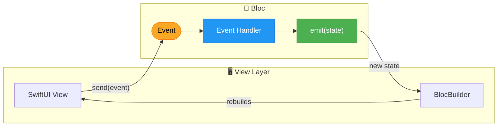
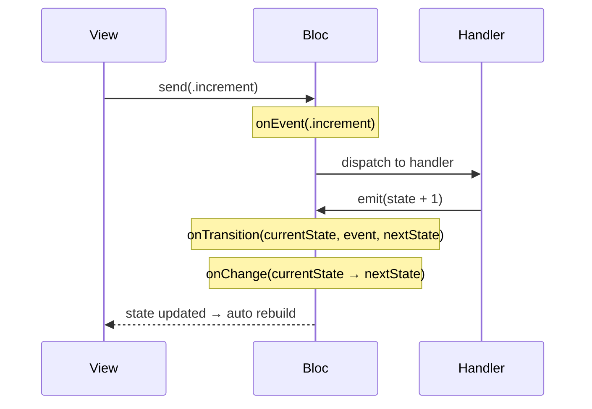
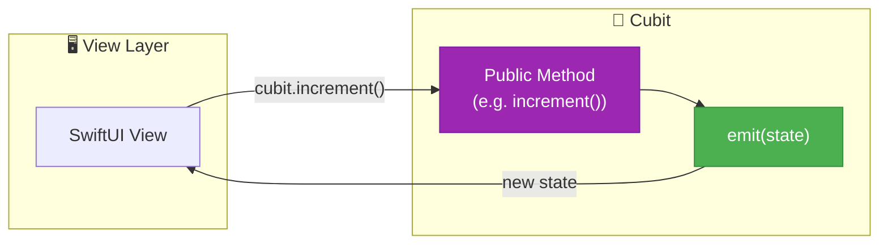

# Bloc

[](https://swiftpackageindex.com/sergiofraile/BlocSwift)
[](https://swiftpackageindex.com/sergiofraile/BlocSwift)
[](https://opensource.org/licenses/Apache-2.0)
[](https://github.com/sergiofraile/BlocSwift/actions/workflows/tests.yml)

> **iOS/Swift:** [github.com/sergiofraile/BlocSwift](https://github.com/sergiofraile/BlocSwift) · **Kotlin counterpart:** [github.com/sergiofraile/BlocKotlin](https://github.com/sergiofraile/BlocKotlin)

A Swift implementation of the [Bloc pattern](https://bloclibrary.dev/) for building applications in a consistent and understandable way, with composition, testing, and ergonomics in mind.

> **Inspired by the [Dart Bloc library](https://bloclibrary.dev)** — this is a Swift port of the [bloc](https://pub.dev/packages/bloc) package originally created by Felix Angelov for Flutter/Dart. The same proven, event-driven state management pattern that powers thousands of Flutter apps worldwide, brought natively to Swift.

* [What is Bloc?](#what-is-bloc)
* [Getting Started](#getting-started)
* [Core Concepts](#core-concepts)
* [Basic Usage](#basic-usage)
* [Examples](#examples)
  * [Counter](#-counter-example)
  * [Timer](#-timer-example)
  * [Calculator](#-calculator-example)
  * [Heartbeat](#-heartbeat-example)
  * [Score](#-score-example)
  * [Formula One](#-formula-one-example)
  * [Lorcana](#-lorcana-example)
* [Documentation](#documentation)
* [Installation](#installation)
* [Requirements](#requirements)
* [License](#license)

## What is Bloc?

**Bloc** (Business Logic Component) is a predictable state management pattern that helps separate presentation from business logic, making your code easier to test, maintain, and reason about.

The pattern is built around three core principles:

1. **Unidirectional Data Flow**: Events flow in → State flows out
2. **Single Source of Truth**: The Bloc holds the authoritative state
3. **Predictable State Changes**: State can only change in response to events

### Data Flow



### Lifecycle Hooks

Every state change follows a predictable sequence of lifecycle hooks — ideal for logging, analytics, or debugging:



### Cubit — Lightweight Alternative

For simpler state logic that doesn't need an event audit trail, use a `Cubit` with direct method calls instead:



## Getting Started

### A Simple Counter

Let's build a counter to demonstrate the core concepts.

**1. Define your Events**

Events represent user actions or occurrences that can trigger state changes:

```swift
enum CounterEvent: Hashable {
    case increment
    case decrement
    case reset
}
```

**2. Create your Bloc**

The Bloc contains your business logic and manages state transitions:

```swift
import Bloc

@MainActor
class CounterBloc: Bloc<Int, CounterEvent> {
    
    init() {
        super.init(initialState: 0)
        
        on(.increment) { [weak self] event, emit in
            guard let self else { return }
            emit(self.state + 1)
        }
        
        on(.decrement) { [weak self] event, emit in
            guard let self else { return }
            emit(self.state - 1)
        }
        
        on(.reset) { event, emit in
            emit(0)
        }
    }
}
```

**3. Provide the Bloc**

Wrap your view hierarchy with `BlocProvider` to make Blocs available:

```swift
import SwiftUI
import Bloc

@main
struct MyApp: App {
    var body: some Scene {
        WindowGroup {
            BlocProvider(with: [
                CounterBloc()
            ]) {
                ContentView()
            }
        }
    }
}
```

**4. Use in your View**

Access the Bloc and its state directly—SwiftUI automatically observes changes:

```swift
struct CounterView: View {
    let counterBloc = BlocRegistry.resolve(CounterBloc.self)
    
    var body: some View {
        VStack(spacing: 20) {
            Text("Count: \(counterBloc.state)")
                .font(.largeTitle)
            
            HStack(spacing: 40) {
                Button("−") { counterBloc.send(.decrement) }
                Button("+") { counterBloc.send(.increment) }
            }
            .font(.title)
            
            Button("Reset") { counterBloc.send(.reset) }
        }
    }
}
```

That's it! No `@State` mirroring, no `.onReceive`—just direct state access with automatic SwiftUI updates.

## Core Concepts

### State

State represents the data your UI needs to render. States must conform to `Equatable`:

```swift
// Simple state (using a primitive type)
class CounterBloc: Bloc<Int, CounterEvent> { ... }

// Complex state (using a custom type)
struct LoginState: Equatable {
    var email: String = ""
    var password: String = ""
    var isLoading: Bool = false
    var error: String?
}

class LoginBloc: Bloc<LoginState, LoginEvent> { ... }
```

### Events

Events are inputs to a Bloc—they trigger state changes. Events must conform to `Equatable & Hashable`:

```swift
// Simple enum events
enum CounterEvent: Hashable {
    case increment
    case decrement
}

// Events with associated values
enum LoginEvent: Hashable {
    case emailChanged(String)
    case passwordChanged(String)
    case loginButtonTapped
    case loginSucceeded(User)
    case loginFailed(String)
}
```

### Bloc

The Bloc is where your business logic lives. It receives events and emits new states:

```swift
@MainActor
class LoginBloc: Bloc<LoginState, LoginEvent> {
    private let authService: AuthService
    
    init(authService: AuthService) {
        self.authService = authService
        super.init(initialState: LoginState())
        
        on(.emailChanged) { [weak self] event, emit in
            guard let self, case .emailChanged(let email) = event else { return }
            var newState = self.state
            newState.email = email
            emit(newState)
        }
        
        on(.loginButtonTapped) { [weak self] event, emit in
            guard let self else { return }
            var newState = self.state
            newState.isLoading = true
            emit(newState)
            
            Task {
                await self.performLogin()
            }
        }
    }
    
    private func performLogin() async {
        do {
            let user = try await authService.login(
                email: state.email,
                password: state.password
            )
            send(.loginSucceeded(user))
        } catch {
            send(.loginFailed(error.localizedDescription))
        }
    }
}
```

### BlocProvider

`BlocProvider` registers Blocs and makes them available throughout your view hierarchy:

```swift
BlocProvider(with: [
    CounterBloc(),
    LoginBloc(authService: LiveAuthService()),
    SettingsBloc()
]) {
    MainTabView()
}
```

### BlocRegistry

`BlocRegistry` provides type-safe access to registered Blocs:

```swift
// In any view within the BlocProvider hierarchy
let counterBloc = BlocRegistry.resolve(CounterBloc.self)
let loginBloc = BlocRegistry.resolve(LoginBloc.self)
```

If you try to resolve a Bloc that hasn't been registered, you'll get a helpful error message:

```
Bloc of type 'SettingsBloc' has not been registered.

Currently registered Blocs: [CounterBloc, LoginBloc]

Make sure to register it in your BlocProvider:

    BlocProvider(with: [
        SettingsBloc(initialState: ...),
        // ... other blocs
    ]) {
        YourContentView()
    }
```

## Basic Usage

### Handling Events with Associated Values

For events with associated values, use `mapEventToState`:

```swift
@MainActor
class SearchBloc: Bloc<SearchState, SearchEvent> {
    
    init() {
        super.init(initialState: SearchState())
        
        // Simple events can use `on(_:handler:)`
        on(.clearResults) { event, emit in
            emit(SearchState())
        }
    }
    
    // Events with associated values use `mapEventToState`
    override func mapEventToState(event: SearchEvent, emit: @escaping Emitter) {
        switch event {
        case .queryChanged(let query):
            var newState = state
            newState.query = query
            emit(newState)
            
        case .search:
            emit(SearchState(query: state.query, isLoading: true))
            Task { await performSearch() }
            
        case .resultsLoaded(let results):
            emit(SearchState(query: state.query, results: results))
            
        case .clearResults:
            break // Handled by `on(_:handler:)`
        }
    }
}
```

### Async Operations

Handle async operations by emitting loading states and using `Task`:

```swift
on(.fetchData) { [weak self] event, emit in
    guard let self else { return }
    
    // Emit loading state
    emit(.loading)
    
    // Perform async work
    Task {
        do {
            let data = try await self.api.fetchData()
            self.emit(.loaded(data))
        } catch {
            self.emit(.error(error.localizedDescription))
        }
    }
}
```

### Combine Integration

For advanced reactive patterns, use the Combine publisher:

```swift
// Subscribe to state changes with Combine
counterBloc.statePublisher
    .sink { state in
        print("State changed to: \(state)")
    }
    .store(in: &cancellables)
```

## Examples

The project includes seven example implementations, each highlighting a different library feature:

| Example | Key Feature | Complexity |
|---------|-------------|------------|
| Counter | `HydratedBloc`, state persistence | Beginner |
| Timer | `Cubit`, async tick loop | Beginner |
| Calculator | Lifecycle hooks (`onEvent`, `onChange`, `onTransition`) | Intermediate |
| Heartbeat | Scoped Bloc, `close()` on dismiss | Intermediate |
| Score | `BlocListener`, `BlocConsumer` | Intermediate |
| Formula One | Async network, enum states | Intermediate |
| Lorcana | Debounced search, pagination, `BlocSelector` | Advanced |

### 🔢 Counter Example

A simple counter that demonstrates the fundamentals:

| Aspect | Details |
|--------|---------|
| **State** | `Int` (primitive type) |
| **Events** | `increment`, `decrement`, `reset` |
| **Patterns** | Basic event handlers with `on(_:handler:)` |

**Location:** `BlocSwift/Examples/Counter/`

```swift
// Simple state access
Text("Counter: \(counterBloc.state)")

// Send events
counterBloc.send(.increment)
```

### ⏱️ Timer Example

A Cubit-based stopwatch — the simplest form of state management with no events required:

| Aspect | Details |
|--------|---------|
| **State** | `struct` with elapsed time and running status |
| **Patterns** | `Cubit`, async tick loop, `start` / `pause` / `reset` |

**Location:** `BlocSwift/Examples/Timer/`

```swift
// Cubit — emit state directly, no events needed
class TimerCubit: Cubit<TimerState> {
    func start() {
        Task { while state.isRunning { await tick() } }
    }

    func pause() { emit(state.paused()) }
    func reset() { emit(.initial) }
}
```

**Key Learnings:**
- Use `Cubit` when there are no complex event flows to model
- Emit state directly without defining event types
- Keep async loops tied to state (`isRunning`) so they stop cleanly

### 🔢 Calculator Example

Demonstrates every lifecycle hook available on a Bloc:

| Aspect | Details |
|--------|---------|
| **State** | Calculator display value and operation |
| **Patterns** | `onEvent`, `onChange`, `onTransition`, `onError` overrides |

**Location:** `BlocSwift/Examples/Calculator/`

```swift
class CalculatorBloc: Bloc<CalculatorState, CalculatorEvent> {
    override func onEvent(_ event: CalculatorEvent) {
        super.onEvent(event)
        log("Event received: \(event)")
    }

    override func onTransition(_ transition: Transition<CalculatorState, CalculatorEvent>) {
        super.onTransition(transition)
        log("\(transition.currentState) → \(transition.nextState)")
    }
}
```

**Key Learnings:**
- Override lifecycle hooks for logging, analytics, or debugging
- `onChange` fires for every state change; `onTransition` includes the triggering event
- `onError` lets you handle and recover from unexpected failures

### 💓 Heartbeat Example

Shows how to scope a Bloc to a single screen and clean it up on dismiss:

| Aspect | Details |
|--------|---------|
| **State** | Heartbeat rate and active status |
| **Patterns** | Scoped `BlocProvider`, `close()` lifecycle management |

**Location:** `BlocSwift/Examples/Heartbeat/`

```swift
// Provide a Bloc scoped only to this screen
HeartbeatView()
    .blocProvider(HeartbeatBloc())

// Inside the view — close() is called automatically on disappear
.onDisappear { heartbeatBloc.close() }
```

**Key Learnings:**
- Not all Blocs need to live at the app root — scope them to the screen that needs them
- Always call `close()` when a scoped Bloc is no longer needed to cancel ongoing work
- `BlocProvider` at the view level creates and disposes the Bloc with the view

### 🏆 Score Example

Demonstrates `BlocListener` for one-time side effects and `BlocConsumer` for combined listen + build:

| Aspect | Details |
|--------|---------|
| **State** | Score value and tier (Bronze / Silver / Gold) |
| **Patterns** | `BlocListener` for milestone alerts, `BlocConsumer` for tier badge |

**Location:** `BlocSwift/Examples/Score/`

```swift
// BlocListener — react to state without rebuilding the view
BlocListener<ScoreBloc, ScoreState>(
    listenWhen: { previous, current in current.score % 10 == 0 },
    listener: { state in showMilestoneAlert(state.score) }
) { ... }

// BlocConsumer — listen AND build in one place
BlocConsumer<ScoreBloc, ScoreState>(
    listenWhen: { _, current in current.tier != previous.tier },
    listener: { state in animateTierBadge() },
    builder: { state in TierBadgeView(tier: state.tier) }
)
```

**Key Learnings:**
- Use `BlocListener` for navigation, dialogs, toasts — anything that shouldn't affect the widget tree
- Use `BlocConsumer` when the same state change needs both a side effect and a UI update
- `listenWhen` / `buildWhen` prevent unnecessary listener calls and rebuilds

### 🏎️ Formula One Example

A more complex example with async operations and enum-based states:

| Aspect | Details |
|--------|---------|
| **State** | `enum` with cases: `initial`, `loading`, `loaded([Driver])`, `error` |
| **Events** | `loadChampionship`, `clear` |
| **Patterns** | Async network calls, `mapEventToState`, state-driven UI |

**Location:** `BlocSwift/Examples/FormulaOne/`

```swift
// State-driven UI with switch
switch formulaOneBloc.state {
case .initial:
    Button("Load") { formulaOneBloc.send(.loadChampionship) }
case .loading:
    ProgressView("Loading...")
case .loaded(let drivers):
    DriversList(drivers: drivers)
case .error(let error):
    ErrorView(error: error)
}
```

**Key Learnings:**
- Use enum states for mutually exclusive UI modes
- Emit `.loading` immediately before async work
- Pattern match on state for declarative UI

### ✨ Lorcana Example

A comprehensive trading card game browser demonstrating search, pagination with infinite scroll, and multi-screen navigation:

| Aspect | Details |
|--------|---------|
| **State** | `struct` with cards, sets, pagination, loading states, and search query |
| **Events** | `fetchAllCards`, `search(query)`, `loadNextPage`, `loadSet(name)`, `clear` |
| **Patterns** | Debounced search, infinite scroll pagination, async image loading, multi-screen navigation, ink color theming |

**Location:** `BlocSwift/Examples/Lorcana/`

```swift
// State with pagination support
struct LorcanaState: Equatable {
    var cards: [LorcanaCard]
    var searchQuery: String
    var currentPage: Int
    var hasMorePages: Bool
    var isLoading: Bool
    var isLoadingMore: Bool
}

// Events for search and pagination
enum LorcanaEvent: BlocEvent {
    case clear
    case fetchAllCards
    case loadNextPage
    case search(query: String)
    case loadSet(setName: String)
}
```

**Key Features:**
1. **Debounced Search** - Searches after 3+ characters with 0.3s debounce
2. **Infinite Scroll Pagination** - Loads 100 cards per page, triggers on last item visible
3. **Multi-Screen Navigation** - Card detail → Set detail flow with back navigation
4. **Ink Color Theming** - Each card's UI adapts to its ink color (Amber, Amethyst, Emerald, Ruby, Sapphire, Steel)

**File Structure:**
```
Lorcana/
├── Blocs/
│   ├── LorcanaBloc.swift       # Business logic with pagination
│   ├── LorcanaEvent.swift      # Search/pagination events
│   └── LorcanaState.swift      # State with cards, pagination, loading
├── Models/
│   ├── LorcanaCard.swift       # Card model with ink colors
│   ├── LorcanaSet.swift        # Set model
│   └── LorcanaError.swift      # Custom error type
├── Services/
│   └── LorcanaNetworkService.swift  # API integration with Alamofire
├── LorcanaView.swift           # Main view with search + infinite scroll
├── LorcanaCardDetailView.swift # Card detail with set navigation
└── LorcanaSetDetailView.swift  # Set detail with card grid
```

**API Integration:** [Lorcana API](https://lorcana-api.com/docs/cards/fetching-cards)
- **All Cards**: `GET /cards/all?page=1&pagesize=100`
- **Search by Name**: `GET /cards/{cardName}`
- **Cards by Set**: `GET /cards/fetch?search=set_name={setName}`

> 📖 See the DocC documentation for a complete walkthrough of each example.

## Documentation

The full API reference is hosted at **[blocswift.thewalkingpuffin.com](https://blocswift.thewalkingpuffin.com)**.

You can also generate the docs locally in Xcode via **Product → Build Documentation** (or `⌃⇧⌘D`).

### Articles

- **Getting Started**: Your first Bloc in 5 minutes
- **Examples**: Complete walkthrough of Counter and Formula One examples
- **State Management**: Designing effective state types
- **Event Handling**: Patterns for complex event logic
- **Best Practices**: SOLID principles and architecture tips

## Installation

### Swift Package Manager

Add Bloc to your `Package.swift`:

```swift
dependencies: [
    .package(url: "https://github.com/sergiofraile/BlocSwift.git", from: "1.0.0")
    // Or from a repository:
    // .package(url: "https://github.com/user/Bloc.git", from: "1.0.0")
]
```

Or in Xcode:

1. **File → Add Package Dependencies...**
2. Enter the package URL or path
3. Add `Bloc` to your target

## Requirements

| Platform | Minimum Version |
|----------|-----------------|
| iOS      | 17.0+           |
| macOS    | 14.0+           |
| tvOS     | 17.0+           |
| watchOS  | 10.0+           |
| Swift    | 5.9+            |

## Inspiration

This library is inspired by:

- [bloclibrary.dev](https://bloclibrary.dev/) - The original Bloc pattern for Flutter/Dart
- [The Composable Architecture](https://github.com/pointfreeco/swift-composable-architecture) - Point-Free's state management library
- [Redux](https://redux.js.org/) - Predictable state container for JS apps

## License

This library is released under the Apache 2.0 license. See [LICENSE](LICENSE) for details.

---

**Built with ❤️ for the Swift community**

[](https://ko-fi.com/sergiof)
